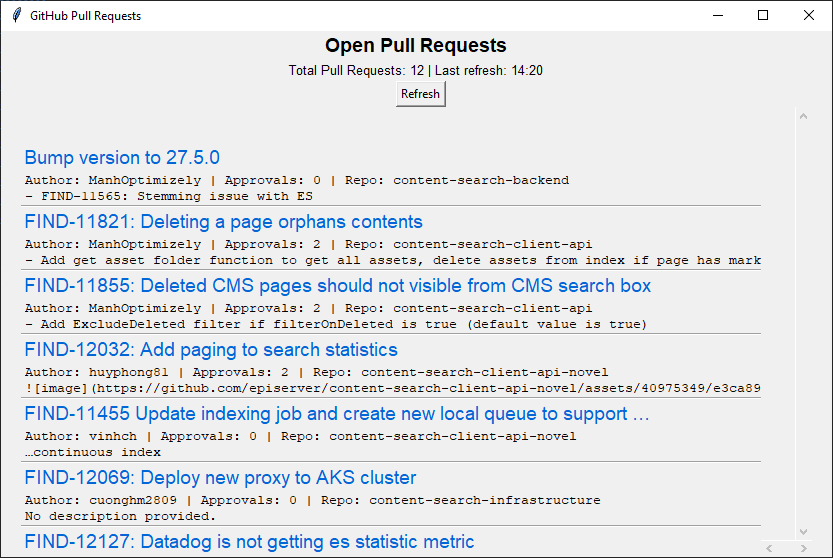

# Pull Request App
An app for listing available pull requests of interest to you.


## Setup
- Create a GitHub **Personal access token** (classic) in GitHub [Settings >> Developer Settings >> Personal access token >> Tokens (classic)](https://github.com/settings/tokens) and paste it in [secret_pat.txt](https://github.com/episerver/tool-pull-request-app/blob/master/secret_pat.txt)
- Add all repositories in [config.json](https://github.com/episerver/tool-pull-request-app/blob/master/config.json) that you are interested in (see example below)
- Install the Python dependencies `pip install requests json5
`
### Example
To configure the app to monitor all find repositories, update the list in [config.json](https://github.com/episerver/tool-pull-request-app/blob/master/config.json) like this:
```
"repositories": [
    "episerver/content-search-backend",
    "episerver/content-search-client-api",
    "episerver/content-search-client-api-novel",
    "episerver/content-search-config",
    "episerver/content-search-demo-accounts",
    "episerver/content-search-dev-ops-tools",
    "episerver/content-search-elasticsearch",
    "episerver/content-search-infrastructure",
    "episerver/content-search-middleware",
    "episerver/content-search-middleware-js",
    "episerver/content-search-service-queue",
    "episerver/content-search-statistics-dashboard",
    "episerver/content-search-statistics-p-number-metric-indexer",
    "episerver/opti-graph-netclient",
    "episerver/Support",
    "episerver/tool-pull-request-app"
],
```
